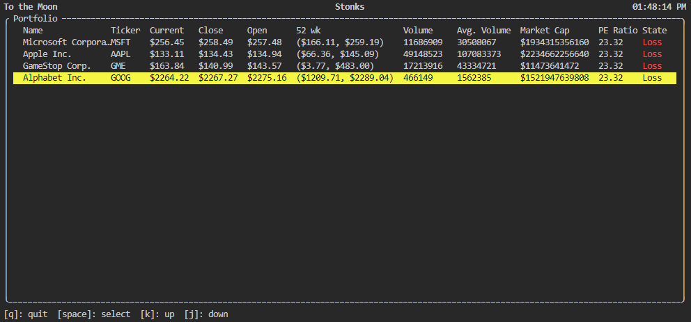

# StonkTop
Python based terminal user interface (TUI) for tracking stocks. Inspired by [cointop](https://github.com/miguelmota/cointop).

The project is built using [urwid](https://github.com/urwid/urwid) a CUI library for Python. 

Data structures heavily lifted from [stui](https://github.com/mil-ad/stui), a Slurm dashboard for the terminal.

## How to Run
Sample `data.json` file located in `./tests`.

1. Create virtualenv
2. Install package with `python setup.py develop` to set up `.egg-link`
3. `cd ./tests`
4. `stonktop`

## To Do:
- ~~Add yfinance integration to pull down real stock data~~
- ~~Add portfolio data.json file to maintain persistance~~
- De-couple data download from terminal application update
- Add pop-up that allows adding tickers
- Add ability to delete stocks
- Add ability to sort by columns
- Update state based on gain/loss
- Add pop-up on start-up that allows setting data.json file path
- Add portfolio data.json update on new data pull (need to figure out logic for when to update)

## Fixes:
- ~~Change focus to be at the top most stock widget, not bottom~~
- Initialization doesn't populate stocks until after stock update time